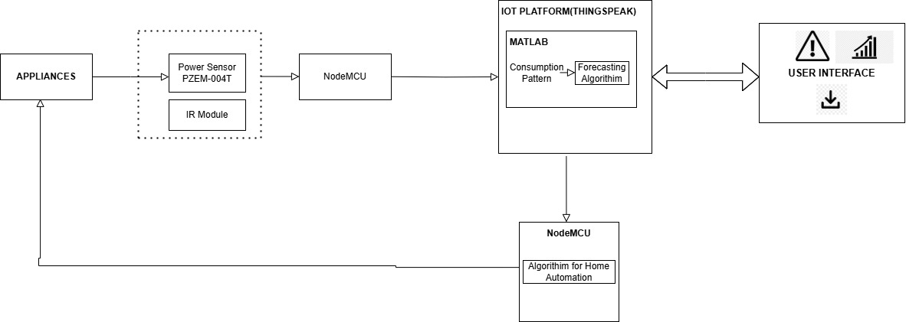
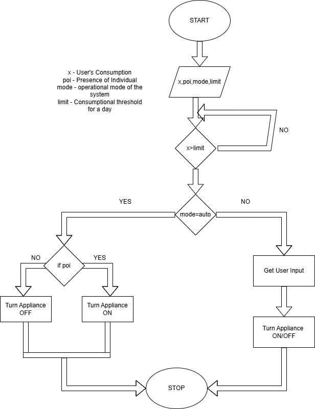

# BarelyTokenized <br> #Take Control of Your Energy

## Overview
The energy sector faces critical challenges, including energy security, energy equity, and environmental sustainability. Traditional energy systems suffer from monopolistic conditions, opaque carbon credit trading, and limited participation of small-scale renewable energy producers.

This project leverages **blockchain technology enhanced with ZK-SNARKs** to enable transparent, secure, and decentralized peer-to-peer (P2P) energy trading. By integrating **smart meters, IoT devices like sensors, and smart contracts**, the system ensures **real-time verification, efficient and sustainable energy distribution, and privacy-preserving transactions**.

The primary goals of this project are:
- **Decentralized Energy Trading:** Enabling prosumers to directly participate in energy markets using blockchain-based verification.
- **Automated Carbon Credit Trading:** Promoting more and more sustainable prosumers.
- **Smart Contract-Based Settlements:** Implementing automated trading and settlement mechanisms.
- **IoT Integration:** Using smart meters to accurately monitor energy consumption and send signal to start the verification of Energy Transfer.
- **Privacy Protection:** Implementing **ZK-SNARKs** to secure sensitive trading data and verify the energy transfer.
- **Scalability & Accessibility:** Reducing barriers for small-scale renewable energy producers and ensuring profit of both the parties i.e., buyer and seller of energy to ensure equitable market participation ensuring scalability of the model.

## Approach for Energy Transfer
The model for energy transfer is based on **Bidding Model**. This project provides a platform for prosumers where they can place their bids to buy or sell the energy that is present with them. Our Algorithm which is present in **Smart Contracts** tries to assign the best price possible for both buyer and seller. Energy is then transferred at a **optimal cost**. On transfer of energy, IoT device sends a signal to ZK-SNARKs' circuits in order to secure and scale the transactions. This ensures **safe and secure P2P transfer of energy using Blockchain which is secured by ZK-SNARKs**. 

Moreover, the **IoT sensors** are installed in every energy generation device which gives the information about the amount of **renewable and non-renewable energy** generated by every prosumer. This information enables us to automate **carbon-credit trading**. The renewable energy producers are given Carbon Credits which they can even use to buy energy or even earn money while the non-renewable energy producers are required to give carbon credits which are then circulated among the renewable producers.

## Key Features
- **Blockchain-Based Smart Grid:** Provides a transparent and immutable energy trading ecosystem.
- **P2P Energy Transactions:** Eliminates intermediaries, ensuring fair market participation along with justice to small-scale prosumers.
- **IoT & Smart Meter Integration:** Tracks type of energy source along with sending signal after transfer of energy and gives information about energy consumption pattern to the users.
- **Carbon Credit Trading:** Takes Carbon Credits from Non-Renewable Energy Producers and giving them to renewable producers to encourage sustainability.
- **Automated Order Matching & Settlement:** Smart contracts handle real-time energy trading.
- **Privacy-Preserving Technology:** ZK-SNARKs protect confidential transaction data.

## System Architecture
### Bidding and Sorting
The buyers and sellers, that is the prosumers, bid for the amount they want to buy or sell.
### IoT and Smart Meter Integration
Smart Meter sends meter readings to the server at a fixed time interval using NodeMCU. The system features an alerting system, a home automation unit, a forecasting system and an android application. The data collection unit comprises the power sensor which is used to measure consumption and a module comprising IR Sensors which we use for the home automation system. Firstly, user's consumption acquired by the power sensor is sent to the NodeMCU. The NodeMCU is used to send the data to the cloud. 





The consumption pattern is monitored and when it surpasses the thresholds, alerts are sent to the user interface. The consumption pattern is displayed in the form of graphs and significant figures as texts for the user's review. The consumption pattern is also provided as an input for the Forecasting algorithm and the NodeMCU used for the home automation system. The IR Module is utilized for the home automation feature. A pair of IR Sensors are installed in the entrance of each room. The order in which the sensors sense human presence is noted for determining whether the user's entering or leaving the room. This information is sent to the NodeMCU which in turn sends it to the cloud.

These values along with the consumption data are sent to the NodeMCU connected to the appliances. On receiving energy, a signal is again send so as to make sure that the energy is transferred from the seller to buyer.


<p align="center">
     
</p>


IoT sensors on solar panels can monitor sunlight exposure, temperature, and power generation, allowing for clear identification of a renewable source like solar energy. For wind energy, sensors can measure wind speed and direction, signifying a renewable source like wind power. Water flow and pressure sensors can monitor the source of hydropower, which is considered renewable. Temperature sensors can indicate the presence of geothermal energy, another renewable source. 
  
By analyzing sensor data over time, algorithms can predict the availability and consistency of an energy source, helping distinguish between renewable (fluctuating but replenished) and non-renewable (finite) sources. If the energy source shows consistent fluctuations based on natural cycles (like sunlight or wind), it is likely renewable. This helps to seperate the producers into renewable and non-renewable.  

## System Components
1. **Blockchain Layer**
   - Smart contracts for trading and settlements
   - Consensus mechanism for transaction validation
   - Transparent and immutable ledger
2. **Smart Grid Management**
   - IoT and smart meters for real-time data collection
   - Energy consumption monitoring
3. **Carbon Credit Trading System**
   - Promoting Renewable Energy Producers by providing them carbon credits
   - Penalising the Non-Renewable Energy Producers by taking carbon credits from them
4. **Privacy & Security**
   - ZK-SNARKs for encrypted transactions
   - Data protection and access control


## How to Run the Project
1. **Install Dependencies for Backend**
   ```bash
   cd server/
   npm install
   ```
2. **Install Dependencies for Backend**
   ```bash
   cd client/
   npm install
   ```
3. **Run the Backend**
   ```bash
   npm run dev
   ```
4. **Start the Frontend**
   ```bash
   npm run dev
   ```
And there should be a .env file in client which should contain NEXT_PUBLIC_API_URL="http://127.0.0.1:7545"
And there should be a .env file in server which should contain DB_URL=<your_mongo_db_url_test_database> and PORT=8000
And you should have Ganache running in the background and metamask setup in Ganache


